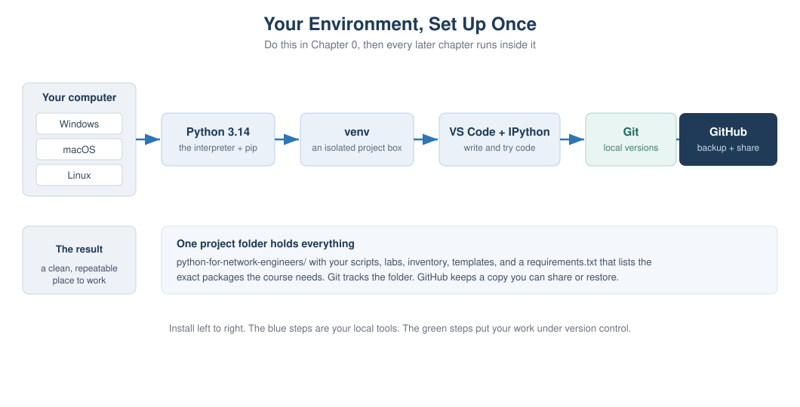
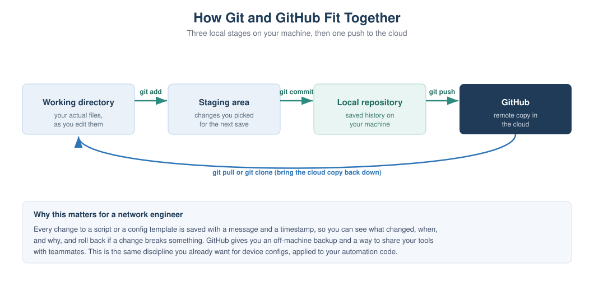

# Chapter 0: Prerequisites and Environment Setup

> **Part 1: Python Foundations for Network Engineers**
> This is the one chapter you do before any coding. By the end your computer
> has Python, an editor, and Git installed, you have a GitHub account, and your
> course project folder is created and saved to GitHub. Everything after this
> runs inside the environment you build here.

## Learning objectives

After this chapter you will be able to:

- Install the latest Python (3.14) and confirm it works on Windows, macOS, or Linux.
- Explain what pip and a virtual environment are, and why every project should have its own.
- Create and activate a virtual environment, and install packages into it.
- Set up VS Code and IPython, and run code interactively line by line.
- Create a GitHub account and install and configure Git.
- Turn your project folder into a Git repository, make your first commit, and push it to GitHub.

## Why this matters to a network engineer

You already treat device configuration with care. You keep backups, you note what
changed, and you can roll back when a change goes wrong. Your automation code
deserves the same discipline, because a script that pushes config to fifty devices
is more dangerous than any single device change.

A clean environment gives you three things. First, your tools are isolated, so a
package you install for one project cannot quietly break another. Second, your work
is version controlled, so every change to a script or a template is saved with a
message and a timestamp and can be undone. Third, your work lives on GitHub, so it
survives a laptop failure and can be shared with your team. Setting this up once,
properly, saves you from a long list of confusing problems later.

## Concept

A working Python environment is a few separate pieces that work together.

The interpreter is the `python` program itself. It reads your code and runs it. We
install the latest version, 3.14, so you get the current syntax and the newest
libraries.

pip is Python's package installer. Most useful network libraries, like netmiko and
napalm, are not built into Python. pip downloads and installs them for you from the
Python Package Index.

A virtual environment is a private copy of Python and its packages for one project.
Without it, everything you install goes into one shared pile, and two projects that
need different versions of the same library will fight. With it, each project gets
its own clean box. You will create one virtual environment for this course.

An editor is where you write code. We use VS Code, which is free, works the same on
all three operating systems, and has good Python support. IPython is an improved
interactive Python shell that lets you type one line, see the result, and type the
next. That is the read-along style this book uses.

Git is a version control tool that runs on your machine and records the history of
your files. GitHub is a website that stores a copy of your Git history in the cloud.
Git is the tool, GitHub is the place. You need both.

## Network example

Think about a Jinja2 template that generates interface configuration. Over a few
weeks you tweak it many times. Without version control, you end up with files named
`template_final`, `template_final_v2`, and `template_really_final`, and no idea
which one is correct. With Git, there is one file, and its full history is saved.
You can see exactly what changed between last Tuesday and today, and if a change
broke your generated config, you can roll back in seconds. That is the everyday
value of the setup in this chapter.

## How it works

When you run `python script.py`, your operating system finds the Python
interpreter, which reads the file and executes it. When you activate a virtual
environment first, your shell is told to use that environment's private Python and
packages instead of the system-wide ones. When you run a Git command, Git updates a
hidden `.git` folder inside your project that holds the complete history. When you
run `git push`, Git sends the new history to GitHub over the network.

## Visual explanation



*Figure 0.1: The pieces you install in this chapter and how they connect. The blue
steps are your local tools. The green steps put your work under version control.*



*Figure 0.2: Git has three local stages, working directory, staging area, and local
repository, moved along with add and commit. Push sends the saved history up to
GitHub, and pull or clone brings it back down.*

## Setup walkthrough

Follow the section for your operating system. Commands you type are shown in code
blocks. Lines that start with `#` are comments for you to read, not to type.

### Part A: Install Python 3.14

**Windows.** Go to python.org, open Downloads, and get the latest Python 3.14
Windows installer (64 bit). Run it. On the very first screen, tick the box that says
"Add python.exe to PATH" before you click Install. This one checkbox prevents the
most common Windows problem, where the `python` command is not found later. Finish
the install, then open a new PowerShell window and check the version:

```powershell
python --version
```

You should see `Python 3.14.x`. Windows also installs a launcher called `py`, so
`py --version` works too.

**macOS.** The Python that ships with macOS is old and meant for the system, not for
your work. Install a fresh one. The simplest way is the python.org macOS installer:
download the latest 3.14 universal installer and run it. Then open Terminal and
check:

```bash
python3 --version
```

If you use Homebrew, `brew install python@3.14` also works. On macOS the command is
`python3`, not `python`.

**Linux (Debian or Ubuntu).** Use the package manager. On recent releases:

```bash
sudo apt update
sudo apt install python3 python3-venv python3-pip
python3 --version
```

If your distribution does not yet package 3.14, the deadsnakes PPA or pyenv can
install it, but any 3.11 or newer will work for the whole course. On Linux the
command is `python3`.

> **Important note:** From here on, where this book writes `python`, use `python`
> on Windows and `python3` on macOS and Linux. The same applies to `pip` versus
> `pip3`. Once your virtual environment is active, `python` and `pip` work
> everywhere, which is one more reason to always work inside it.

### Part B: Confirm pip and upgrade it

pip comes with Python. Confirm it and upgrade it to the latest version:

```bash
python -m pip install --upgrade pip
```

Using `python -m pip` rather than a bare `pip` guarantees you are upgrading the pip
that belongs to the Python you just installed, which avoids another common mix-up.

### Part C: Create and activate a virtual environment

Make the course folder and a virtual environment inside it. Pick a place you can
find easily, such as your home folder.

**Windows (PowerShell):**

```powershell
cd $HOME
mkdir python-for-network-engineers
cd python-for-network-engineers
python -m venv .venv
.\.venv\Scripts\Activate.ps1
```

If activation is blocked with a message about scripts being disabled, run this once,
then activate again:

```powershell
Set-ExecutionPolicy -Scope CurrentUser -ExecutionPolicy RemoteSigned
```

**macOS and Linux (Terminal):**

```bash
cd ~
mkdir python-for-network-engineers
cd python-for-network-engineers
python3 -m venv .venv
source .venv/bin/activate
```

When it is active, your prompt shows `(.venv)` at the start of the line. That is how
you know you are working inside the environment. To leave it later, type
`deactivate`. You do not delete it, you just turn it off, and you activate it again
next time you work on the course.

> **Best practice:** Activate the virtual environment every time you sit down to
> work. If you install a package and later cannot import it, the first thing to
> check is whether `(.venv)` is showing in your prompt.

### Part D: Install VS Code and IPython, and try IPython

Download VS Code from code.visualstudio.com and install it for your operating
system. Open it, go to the Extensions view, and install the "Python" extension from
Microsoft. VS Code has a built-in terminal (View menu, then Terminal) where you can
run all the commands in this book.

Now install IPython into your active environment and start it:

```bash
pip install ipython
ipython
```

You are now in an interactive shell. Type one line at a time and see each result
immediately. This is the read-along style used throughout the book:

```
In [1]: hostname = "core-sw-01"

In [2]: vlans = [10, 20, 30]

In [3]: len(vlans)
Out[3]: 3

In [4]: f"{hostname} carries {len(vlans)} VLANs"
Out[4]: 'core-sw-01 carries 3 VLANs'
```

Type `exit` to leave IPython. You will use it constantly to try small pieces of code
before putting them into a script.

### Part E: Create a GitHub account

Open github.com in your browser and click Sign up. Use an email you will keep, pick a
username (a clean, professional handle is worth it, since colleagues and employers
see it), and set a strong password. Verify your email when GitHub sends the
confirmation.

Then turn on two-factor authentication. In your account settings, under Password and
authentication, enable two-factor authentication using an authenticator app. This
protects the account that will hold your code, and GitHub increasingly requires it
anyway.

> **Warning:** GitHub no longer lets you push code using your account password. When
> Git asks for a credential later, you use a personal access token or an SSH key, not
> your password. We set this up in Part G. This trips up almost everyone the first
> time, so expect it.

### Part F: Install and configure Git

**Windows.** Download Git for Windows from git-scm.com and run the installer. The
default options are fine. This also gives you Git Bash, an alternative terminal, but
you can keep using PowerShell.

**macOS.** Installing the Xcode command line tools gives you Git:

```bash
xcode-select --install
```

Or `brew install git` if you use Homebrew.

**Linux (Debian or Ubuntu):**

```bash
sudo apt install git
```

Now tell Git who you are. This name and email are stamped on every commit you make:

```bash
git --version
git config --global user.name "Your Name"
git config --global user.email "you@example.com"
git config --global init.defaultBranch main
```

Use the same email you used for GitHub, so your commits are linked to your account.

### Part G: Create the repository, first commit, and push

You already have the `python-for-network-engineers` folder from Part C. Turn it into
a Git repository and make your first save. Make sure your virtual environment is
active and you are inside the folder.

First, create two small files. A `requirements.txt` lists the packages the course
uses, and a `.gitignore` tells Git which files to leave out of version control (you
never commit the virtual environment or secrets).

Create `requirements.txt` with this line:

```
ipython
```

Create `.gitignore` with these lines:

```
.venv/
__pycache__/
.env
```

Now initialize Git, stage everything, and commit:

```bash
git init
git add .
git commit -m "Initial commit: course project setup"
```

Create the matching empty repository on GitHub. In the browser, click New
repository, name it `python-for-network-engineers`, leave it empty (do not add a
README from the website, since you already have local files), and create it. GitHub
then shows you the repository URL. Connect your local repository to it and push:

```bash
git remote add origin https://github.com/YOUR-USERNAME/python-for-network-engineers.git
git branch -M main
git push -u origin main
```

The first push asks you to authenticate. In the browser sign-in flow, or when asked
for a password in the terminal, use a personal access token, not your account
password. You create a token in GitHub under Settings, Developer settings, Personal
access tokens. Give it the `repo` scope, copy it, and paste it when Git asks for a
password. Git remembers it after the first time.

Refresh your GitHub repository page. Your files are there. That is the full loop:
write locally, commit, push to GitHub.

## Code walkthrough

A few of these commands are worth understanding rather than just typing.

`python -m venv .venv` creates a folder named `.venv` that contains a private Python
and a private place for packages. Nothing outside this folder is touched, which is
exactly why isolation is safe.

Activating the environment does not change your files. It only changes which Python
your shell uses, for this window, until you deactivate or close it. That is why the
prompt marker matters, it is the only visible sign of which Python is active.

`git add .` moves your current changes into the staging area, and `git commit`
records the staged changes as a permanent point in history with a message. The two
steps are separate on purpose, so you can choose exactly what goes into each save.
`git push` copies your local history up to GitHub. Look back at Figure 0.2 and match
each command to an arrow.

## Lab

**Lab 0.1: From Zero to First Commit** is provided as a worksheet at
`labs/chapter00/lab00_zero_to_first_commit.md`.

**Objective.** Stand up a complete working environment and prove it end to end, from
a fresh install to code pushed on GitHub.

**Network scenario.** You are joining a team that keeps all of its automation in
GitHub. Before you can contribute a single script, your machine has to be set up and
your first commit has to land in a repository.

**Topology.** None. This is all on your computer plus your GitHub account.

**Prerequisites.** A computer running Windows, macOS, or Linux, with administrator
rights to install software, and internet access.

**Files required.** None to start. You create `requirements.txt`, `.gitignore`, and
run `check_setup.py`.

**Steps.**

1. Install Python 3.14 for your operating system and confirm `python --version`.
2. Upgrade pip with `python -m pip install --upgrade pip`.
3. Create the `python-for-network-engineers` folder and a `.venv` virtual environment, then activate it.
4. Install IPython and run the interactive session shown in Part D.
5. Install VS Code and the Python extension.
6. Create a GitHub account and enable two-factor authentication.
7. Install Git and set your `user.name` and `user.email`.
8. Add `requirements.txt` and `.gitignore`, then run `git init`, `git add .`, and `git commit`.
9. Create the empty GitHub repository, add it as `origin`, and `git push`.
10. Copy `check_setup.py` into your `scripts/chapter00/` folder and run it.

**Expected output.** Running the setup check prints something like this (the path and
release differ per machine):

```
Python version : 3.14.0
Operating system: Windows 11
Interpreter path: C:\Users\you\python-for-network-engineers\.venv\Scripts\python.exe
Result: your Python is new enough for this course.
```

And your GitHub repository page shows `requirements.txt`, `.gitignore`, and your
first commit message.

**Verification.** You are done when three things are true: your prompt shows
`(.venv)` when the environment is active, `check_setup.py` reports your Python is new
enough, and your files appear on GitHub.

**Common errors.**

- `python is not recognized` on Windows. You skipped the "Add python.exe to PATH"
  checkbox. Re-run the installer, choose Modify, and enable it, or reinstall.
- Activation blocked on Windows. Run `Set-ExecutionPolicy -Scope CurrentUser
  -ExecutionPolicy RemoteSigned`, then activate again.
- `python: command not found` on macOS or Linux. Use `python3` and `pip3` until the
  environment is active.
- Push rejected or asks for a password that never works. You are using your account
  password. Create a personal access token with the `repo` scope and use that
  instead.
- You committed the `.venv` folder by mistake. Add `.venv/` to `.gitignore`, then run
  `git rm -r --cached .venv` and commit again.

**Student exercise.** See `labs/chapter00/exercise_second_commit.md`. You make a
small change and record a second commit, to prove you can repeat the save loop on
your own. The solution is in `solutions/chapter00/exercise_second_commit_solution.md`.

**Challenge lab.** See `labs/chapter00/challenge_branch_and_readme.md`. You create a
branch, add a README on it, and push the branch to GitHub. The solution is in
`solutions/chapter00/challenge_branch_and_readme_solution.md`.

> **Troubleshooting tip:** If `git push` hangs or fails, first run `git remote -v`
> and confirm the `origin` URL is correct and points at your own username. A typo in
> the remote URL is the usual cause.

## Key takeaways

Install the latest Python and always work inside a per-project virtual environment,
so installs never collide and your prompt shows `(.venv)` when you are set. pip
installs the libraries the course needs, tracked in `requirements.txt`. VS Code is
where you write code and IPython is where you try it line by line. Git records the
history of your files locally, and GitHub keeps a copy in the cloud that you can
restore and share. The save loop is add, commit, push, and you will run it for the
rest of the course. GitHub authentication uses a token or an SSH key, never your
password.

## Review questions

1. What problem does a virtual environment solve, and how can you tell one is active?
2. What is the difference between Git and GitHub?
3. Why do you run `python -m pip` instead of just `pip`?
4. What is the purpose of `.gitignore`, and name two things that belong in it.
5. On Windows, which single installer choice prevents the "python is not recognized" error?
6. Put these in order and say what each does: `git push`, `git commit`, `git add`.
7. Why should the virtual environment folder never be committed to Git?
8. When Git asks for a password to push to GitHub, what should you actually provide?

## Interview questions

1. Walk me through how you set up a clean Python environment for a new automation project.
2. Why is version control important for network automation specifically, not just software development?
3. A teammate says their script works on their laptop but fails on yours. What environment issues would you check first?
4. What is a virtual environment, and what goes wrong without one?
5. How do you keep secrets like device passwords out of a Git repository?

> **Interview tip:** Mentioning virtual environments, a pinned `requirements.txt`,
> and keeping secrets out of Git signals that you think about repeatability and
> safety, which is what separates a hobby script from a tool a team can rely on.

## Repository files for this chapter

- `docs/chapters/chapter00_prerequisites.md` (this chapter)
- `docs/diagrams/ch00_setup_pipeline.svg` (Figure 0.1)
- `docs/diagrams/ch00_git_github_flow.svg` (Figure 0.2)
- `scripts/chapter00/check_setup.py` (environment check)
- `labs/chapter00/lab00_zero_to_first_commit.md` (lab worksheet)
- `labs/chapter00/exercise_second_commit.md` (student exercise)
- `labs/chapter00/challenge_branch_and_readme.md` (challenge lab)
- `solutions/chapter00/exercise_second_commit_solution.md`
- `solutions/chapter00/challenge_branch_and_readme_solution.md`

## What is next

Chapter 1 explains why Python is worth learning for network work and shows the
payoff before you write any code. Because your environment is now ready, you can run
the demo in Chapter 1 straight away. Chapter 2 then starts the Python language
itself with your first programs.
