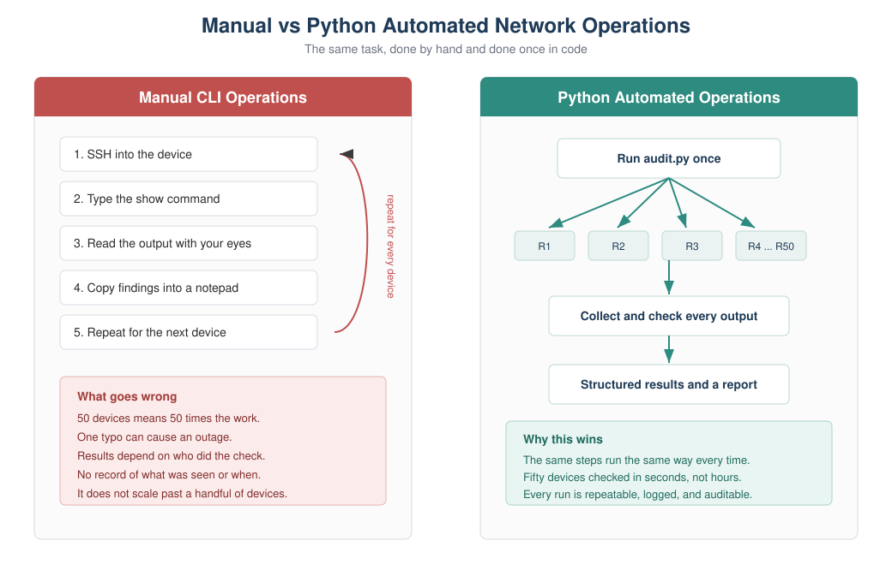
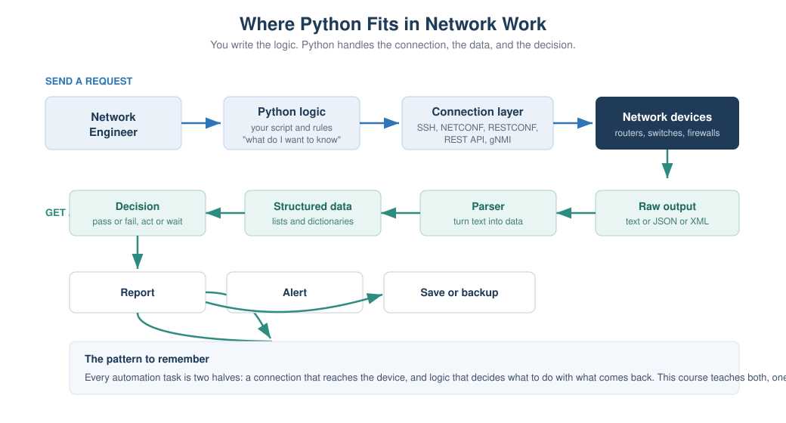

# Chapter 1: Why Python for Network Engineers

> **Part 1: Python Foundations for Network Engineers**
> This chapter is about the why, not the how. It assumes you know nothing about
> Python, and it does not ask you to read or write any real code. You start the
> language itself in Chapter 2, from a single line, and build up one small idea at
> a time.

## Learning objectives

After this chapter you will be able to:

- Explain in plain words why manual command line work stops scaling as a network grows.
- Name the everyday network tasks that Python takes the pain out of.
- Compare Python with Bash, Ansible, and device APIs, and say when each one is the right tool.
- Place Python correctly in a modern network automation workflow.
- Recognize what a single line of Python looks like, without needing to write any yet.

## Why this matters to a network engineer

Picture a normal Tuesday. You have a change window at six in the morning, fifty
branch routers to touch, and a rollback plan that only works if every device was
configured exactly the same way. You SSH into the first router, paste the config,
check the output, move to the next one. Somewhere around router thirty your coffee
is cold, your eyes are tired, and you fat-finger a VLAN number. Now one site is
different from the other forty-nine, and nobody will notice until it breaks two
weeks later during an audit.

None of that is a skills problem. It is a scale problem. A human doing the same
task by hand, over and over, will eventually make a small mistake, and small
mistakes in a network turn into outages. The work is also slow, it depends on one
person being awake, and when someone asks "what was the state of every BGP session
last Friday at 9am," you have no record to show them.

Python does not make you a better engineer. You already know the network. What it
does is take the parts of the job that are repetitive, error prone, and slow, and
do them the same way every time, across as many devices as you want, in seconds,
with a log of exactly what happened. That is the whole pitch. Everything in this
course builds toward it.

## Concept

Automation here means something very simple. Anything you can do by typing at a
device prompt, Python can do for you. It opens a session to the device, sends the
same commands you would type, reads the text that comes back, and then does
something useful with that text. The difference is that it never gets tired, never
skips a device, and never types `vlan 201` when it meant `vlan 210`.

Traditional command line operation looks like this: connect, type a command, read
the result with your eyes, decide what it means, and repeat for the next device.
That loop is fine for one or two devices. It becomes painful at fifty and
impossible to do consistently at five hundred. The reasons are always the same.

Manual work is repetitive, so it wastes your time on tasks a machine should own.
It is inconsistent, because two engineers, or the same engineer on two different
days, will not do the check in exactly the same way. It is error prone, because
typing the same thing a hundred times invites a typo. It leaves no record, so you
cannot prove what the network looked like at a point in time. And it does not
scale, because the effort grows in a straight line with the number of devices.

> **Important note:** Python does not replace your networking knowledge. It gives
> that knowledge reach. You still decide what "healthy" means for a BGP session or
> an interface. Python just applies your decision everywhere, at once.

## Network example

Here are six tasks that show up in almost every network job. You will build a
real, working version of each one during this course. Read them now as a preview
of what Python is good for.

Checking one hundred routers. Instead of opening one hundred SSH sessions, one
script connects to all of them and reports which are reachable and which are not.

Backing up configurations. Rather than copying and pasting running configs into
files by hand, a script pulls the config from every device and saves each one with
a timestamp, every night, without you being there.

Finding interface errors. A script collects interface counters from the whole
fleet and shows only the interfaces with rising error rates, so you look at the
five that matter instead of scrolling through thousands of lines.

Checking BGP neighbors. A script asks every router about its BGP sessions and
flags any neighbor that is not in the established state, so you find the broken
peering before your customer does.

Bulk VLAN creation. Instead of adding the same VLAN on forty switches by hand, a
script pushes it to all of them from one list, the same way each time.

Validating IP addresses. Before you deploy anything, a script checks that every
address in your plan is a real, correctly formatted address in the right subnet,
so a bad entry is caught on your laptop and not on the router.

> **Example:** Later in this chapter you will read a small script that does a
> simplified version of the interface check. It takes a table of interface states
> and pulls out only the ones that are supposed to be up but are actually down.

## How it works

Under the hood, every one of those tasks is built from two halves.

The first half is the connection. Python uses a library to open a session to the
device. Depending on the device and what it supports, that session might be SSH to
a command line, or a REST API call over HTTPS, or a NETCONF session, or a gNMI
stream. You do not have to build any of that yourself. You pick a library, give it
an address and credentials, and it hands you a connection.

The second half is the logic. Once the command output comes back as text, you
decide what to do with it. You might search it for a pattern, count something,
compare it to what you expected, save it to a file, or raise an alert. This is
where your networking judgment lives, expressed as a few lines of Python.

That split is worth remembering, because the whole course follows it. The device
connection chapters (netmiko, scrapli, REST, NETCONF) teach the first half. The
data handling chapters (data types, files, regular expressions, parsing) teach the
second half. Put the two together and you have automation.

## Visual explanation



*Figure 1.1: Manual vs Python automated network operations. On the left, the same
steps are repeated by hand for every device, and the effort and risk grow with the
device count. On the right, one script fans out to the whole fleet and returns a
structured, repeatable result.*



*Figure 1.2: Where Python fits. You supply the logic. Python handles the
connection to the device, turns the raw output into data you can work with, makes
the decision you defined, and produces a report, an alert, or a saved backup.*

## What Python code looks like

You do not know any Python yet, and that is fine. This book does not ask you to
read a real program in this chapter. You start writing code in Chapter 2, from the
very first line, and every new idea after that uses only what you have already
learned.

So the word code is not a mystery, here is the smallest possible Python program:

```python
print("Starting the interface check")
```

That is one complete line. The word `print` is a built-in instruction that means
"show this on the screen." The text inside the quotes is what gets shown. When you
run it, you see exactly this:

```
Starting the interface check
```

That single idea, telling Python to show something, is where Chapter 2 begins. From
there you learn to store a value, then to show several values together, then to make
a simple decision, and only later to repeat an action across many devices. Each step
is small and rests on the one before it. By the time you reach a program that checks
the interfaces on fifty routers, you will have written every part of it yourself and
understood each line as you added it.

> **Important note:** There is an optional look-ahead script in the repository,
> `scripts/chapter01/interface_audit_demo.py`, that shows these ideas working
> together in a fuller program. You are not expected to understand it yet, and you
> can safely ignore it for now. Come back to it after Chapter 5 and it will read
> like plain English.

## Python compared with the other tools

Python is not the only way to automate a network, and it is not always the best
one. Knowing when to reach for something else is part of using it well.

Bash is excellent for short, local, glue tasks: renaming files, chaining a few
commands, scheduling a job. It gets awkward the moment you need to reach into
command output, make decisions on structured data, or handle errors cleanly.
Python handles all of that comfortably, so the rule of thumb is Bash for a few
lines of plumbing, Python once there is real logic.

Ansible is a configuration management tool with many ready-made network modules.
It is great for pushing a known desired state to devices with little to no code,
and teams like it because playbooks read almost like a checklist. It is less suited
to tasks with lots of custom logic, complex parsing, or anything that does not fit
its model. A common and healthy setup is Ansible for straightforward config
pushes and Python for everything with real logic behind it. They are not rivals.

Device APIs (REST, NETCONF, RESTCONF, gNMI) are not an alternative to Python, they
are a better door into the device. Older gear only offers a command line, so you
automate by sending CLI commands and reading text back. Newer gear offers APIs that
return structured data directly, which is cleaner and more reliable. Python is how
you talk to those APIs. So the comparison is really Python plus CLI versus Python
plus an API, and you will learn both, because real networks are a mix of old and
new.

*Table 1.1: When to use each tool*

| Tool | Best at | Weak at | Typical use with a network |
|------|---------|---------|----------------------------|
| Bash | Short local glue, scheduling | Logic, parsing, error handling | Wrapping and scheduling scripts |
| Ansible | Pushing known config state | Heavy custom logic and parsing | Standard config rollout |
| Device APIs | Returning structured data | Nothing, but not on old gear | The cleanest way in, driven by Python |
| Python | Logic, data, glue, scale | Being the shortest possible one-liner | The general purpose automation language |

> **Best practice:** Do not think of these as competitors. Mature automation
> setups use Bash to schedule, Python for logic, Ansible for standard pushes, and
> APIs wherever the hardware supports them. Python is the piece that ties the rest
> together.

## Where Python fits in network automation

If you zoom out, a modern automation setup has a few layers, and Python threads
through most of them. There is a source of truth that holds what the network should
look like (inventory, addresses, intended config). There is a connection layer that
reaches the devices. There is logic that collects state, compares it to intent, and
decides what to do. And there is output: reports, alerts, backups, and changes.

You will build a small version of every one of those layers in this course, and by
the capstone you will connect them into a single tool. For now, just hold the shape
in your head. Python is the glue and the brains. The devices, the APIs, and the
data formats are the parts it connects.

## Lab

**Lab 1.1: Count the Cost of Manual Work** is a thinking lab, provided as a
worksheet at `labs/chapter01/lab01_cost_of_manual_work.md`. It needs no computer
and no code. The point is to feel, in numbers, why automation is worth learning.

**Objective.** Estimate the time and error cost of a manual daily check, and
compare it to an automated one.

**Network scenario.** Every morning your team checks that the WAN interface is up
on each branch router.

**Prerequisites.** None. Bring a pen.

**Steps.**

1. Suppose you have 60 branch routers, and it takes about 45 seconds to log in, run
   one command, read the result, and log out of each one. How long does the full
   manual check take each morning?
2. Over a five-day week, how much time is that?
3. People make small mistakes when doing the same thing over and over. If you misread
   just one router in fifty, roughly how many misreads might you make across a month
   of daily checks?
4. Now assume an automated check runs in about 30 seconds for all 60 routers and
   never misreads. How much time does it save per week?
5. Write two or three sentences on what you would do with the time saved.

**Expected result.** Rough numbers are fine. The manual check is about 45 minutes a
day, close to four hours a week. The automated check is under a minute. The saving
is large, and the misread rate on the reading step drops to zero.

**Verification.** You have a per-week time saving and a clear sense of how errors
grow as a manual task is repeated.

**Student exercise.** List five tasks you do by hand today that you would like to
automate. For each one, write down the manual steps you follow. Keep this list. As
the course goes on you will build tools for several of them. A sample answer is in
`solutions/chapter01/exercise_manual_tasks.md`.

**Challenge.** From your list, pick the task that would save the most time if
automated, and write down how you would know the automation worked correctly.
Thinking about how to check the result, before you build anything, is a habit that
separates safe automation from risky automation.

> **Best practice:** Keep the list from the exercise somewhere you will see it. It
> becomes your personal backlog, and finishing this course means turning several of
> those manual chores into tools you trust.

## Key takeaways

Manual network operations do not scale, and the failures are consistency and human
error, not lack of skill. Python takes the repetitive parts and does them the same
way every time, across the whole fleet, with a record of what happened. Every
automation task is two halves, a connection to the device and logic about the
output, and the whole course is organized around teaching both. Python is not in
competition with Bash, Ansible, or device APIs. It is the general purpose language
that ties them together. You do not need to write code yet. You need to see the
destination, which is a network you manage through tested, repeatable programs
instead of by hand.

## Review questions

1. Give two concrete reasons manual CLI operations become risky as a network grows.
2. What are the two halves that every automation task is built from?
3. What does the `print` instruction do?
4. In plain words, what is the payoff of automating a daily check across many devices?
5. When would you reach for Bash instead of Python, and when for Python instead of Bash?
6. Are device APIs a replacement for Python? Explain your answer.
7. Name three of the six preview tasks and, in one line each, say what Python does for them.
8. Why is it a good habit to decide how you will check an automation before you build it?

## Interview questions

1. Your team still does a morning health check by hand across sixty devices.
   How would you make the case for automating it, and what would you automate first?
2. When would you choose Ansible over a custom Python script, and when the reverse?
3. A colleague says APIs make Python unnecessary for network automation. How do you respond?
4. What are the risks of automation done badly, and how would you reduce them?
5. Explain the difference between a device's raw CLI output and structured data,
   and why the difference matters for automation.

> **Interview tip:** Interviewers care less about syntax here and more about
> judgment. Show that you know automation is about consistency and safety, that you
> would start small and prove value, and that you pick the tool that fits the task
> rather than forcing one tool onto everything.

## Repository files for this chapter

- `docs/chapters/chapter01_why_python.md` (this chapter)
- `docs/diagrams/ch01_manual_vs_automated.svg` (Figure 1.1)
- `docs/diagrams/ch01_where_python_fits.svg` (Figure 1.2)
- `labs/chapter01/lab01_cost_of_manual_work.md` (lab worksheet)
- `solutions/chapter01/exercise_manual_tasks.md` (sample exercise answer)
- `scripts/chapter01/interface_audit_demo.py` (optional look-ahead, understandable after Chapter 5)
- `labs/chapter01/exercise_count_admin_down.py` (student exercise)
- `labs/chapter01/challenge_group_by_device.py` (challenge lab)
- `solutions/chapter01/lab01_answers.md`
- `solutions/chapter01/exercise_count_admin_down_solution.py`
- `solutions/chapter01/challenge_group_by_device_solution.py`

## What is next

Chapter 2 begins the Python language itself. You write your first real programs,
storing device facts in variables, printing clean output, and converting between
text and numbers, all with networking examples. Your environment is already set up
from Chapter 0, so you can run everything as you go.
