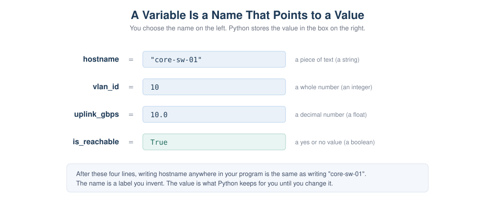
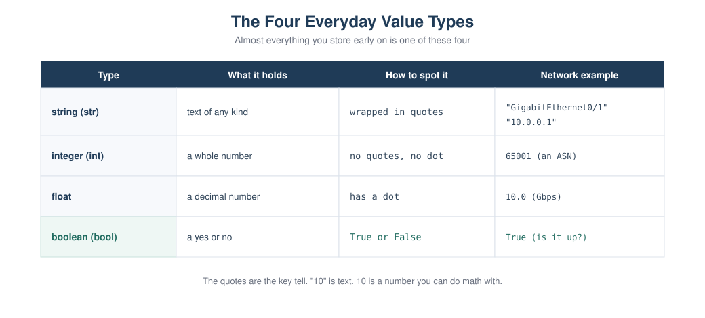

# Chapter 2: Your First Python Programs

> **Part 1: Python Foundations for Network Engineers**
> This is where you actually start writing Python. It assumes you have never
> programmed before. We begin with one line, `print`, and add one small idea at a
> time: comments, variables, text, numbers, true or false values, and how to turn
> one into another. Every example uses network data you already understand.

## Learning objectives

After this chapter you will be able to:

- Show text on the screen with `print`.
- Write comments to leave notes in your code.
- Store a value in a variable and use it later.
- Tell apart the four everyday value types: strings, integers, floats, and booleans.
- Convert between text and numbers, and explain why that is necessary.
- Ask the user for input.
- Combine variables and text neatly with f-strings.

## Why this matters to a network engineer

Everything you automate later is built from these small pieces. When a script
connects to a router, the hostname it uses is stored in a variable. When it reads a
port number from a file, that value arrives as text and has to be turned into a
number before you can do math with it. When it prints a report, it uses f-strings to
drop values into neat lines. None of this is advanced, but all of it shows up in
every real tool. Get comfortable here and the rest of the course is much easier.

## How to work through this chapter

Keep two things open: an IPython shell to try single lines, and VS Code to write
scripts you save and run. When you see a block like the one below, it is an IPython
session. `In [1]:` is what you type. `Out[1]:` is what Python shows back.

```
In [1]: 2 + 2
Out[1]: 4
```

Type the examples yourself. Reading them is not the same as running them.

## Showing text with print

The simplest useful thing a program can do is show something on the screen. In
Python that is the `print` instruction. Put what you want to show inside the
parentheses.

```
In [1]: print("Hello from your first Python program")
Hello from your first Python program
```

Notice there is no `Out[]` line here. `print` shows text as a side effect, it does
not hand a value back. You can print more than one line by calling `print` more than
once. Save this as a file called `hello.py` and run it:

```python
print("Hello from your first Python program")
print("You are about to automate your network")
```

Run it from your terminal (with your virtual environment active) using `python
hello.py`. You get:

```
Hello from your first Python program
You are about to automate your network
```

That is a complete program. Two instructions, run top to bottom.

## Comments

A comment is a note for humans that Python ignores. Anything after a `#` on a line is
a comment. Use comments to explain why something is there, not to repeat what the
code obviously does.

```python
# Print a banner before the audit starts
print("Starting the interface audit")
```

> **Best practice:** Good comments explain intent. A comment like `# add 1 to x` is
> noise. A comment like `# skip the management interface, we never touch it` earns
> its place.

## Variables

Typing the same value over and over is a waste, and it makes changes painful. A
variable lets you store a value under a name you choose, then use that name wherever
you need the value. You create one with a single equals sign: the name on the left,
the value on the right.

```
In [1]: hostname = "core-sw-01"

In [2]: print(hostname)
core-sw-01
```

After that first line, writing `hostname` anywhere is the same as writing
`"core-sw-01"`. If the device is renamed, you change one line instead of hunting
through the whole program.



*Figure 2.1: A variable is a name you invent on the left and a value Python stores on
the right. Later, using the name gives you back the value.*

A few rules for names. Use lowercase letters and underscores, like `vlan_id` or
`mgmt_ip`. Names can contain letters, numbers, and underscores, but cannot start
with a number and cannot contain spaces. Pick names that say what the value is.
`router_ip` is better than `x`.

> **Best practice:** A good variable name is a small gift to the next person who
> reads your code, which is often you, three months later. `bgp_neighbor` beats `bn`.

## The four everyday value types

Early on, almost every value you store is one of four types. You do not declare the
type, Python works it out from how you write the value.



*Figure 2.2: Strings, integers, floats, and booleans, with how to recognize each and
a network example of each.*

A string is text. You write it inside quotes, single or double, it does not matter as
long as they match. Device names, interface names, and yes, IP addresses, are all
text.

```
In [1]: hostname = "core-sw-01"

In [2]: interface = "GigabitEthernet0/1"
```

An integer is a whole number, written with no quotes and no decimal point. VLAN IDs
and AS numbers are integers.

```
In [3]: vlan_id = 10

In [4]: asn = 65001
```

A float is a number with a decimal point. Link speeds or utilization percentages are
often floats.

```
In [5]: uplink_gbps = 10.0
```

A boolean is a yes or no value, written as `True` or `False` with a capital first
letter. It answers a question: is this interface up, is this device reachable.

```
In [6]: is_reachable = True
```

You can ask Python what type a value is with `type`. This is handy when you are not
sure.

```
In [7]: type("core-sw-01")
Out[7]: <class 'str'>

In [8]: type(10)
Out[8]: <class 'int'>

In [9]: type(10.0)
Out[9]: <class 'float'>

In [10]: type(True)
Out[10]: <class 'bool'>
```

The quotes are the key tell. `"10"` is text. `10` is a number. They look almost the
same to you, but Python treats them very differently, as you are about to see.

## Doing a little math

Numbers behave the way you expect. The usual symbols are `+`, `-`, `*` for multiply,
and `/` for divide.

```
In [1]: access_ports = 24

In [2]: uplink_ports = 2

In [3]: access_ports + uplink_ports
Out[3]: 26
```

Text does not add like numbers. Putting a `+` between two strings joins them end to
end, which is occasionally useful but often a trap.

```
In [4]: "Gig" + "0/1"
Out[4]: 'Gig0/1'

In [5]: "24" + "2"
Out[5]: '242'
```

Look at `In [5]` carefully. `"24"` and `"2"` are text, so `+` glued them into
`"242"`, not `26`. This is the single most common beginner surprise, and it matters a
lot in network work, because values that come from files, forms, and device output
almost always arrive as text.

## Converting between types

To move between text and numbers you use conversion functions: `int()` makes a whole
number, `float()` makes a decimal, and `str()` makes text.

```
In [1]: int("22")
Out[1]: 22

In [2]: int("22") + 1
Out[2]: 23

In [3]: str(22)
Out[3]: '22'

In [4]: "port " + str(22)
Out[4]: 'port 22'
```

So the rule is simple. If a number arrived as text and you need to do math, convert
it with `int()` or `float()` first. If you have a number and you want to build a
message, convert it to text with `str()`, or better, use an f-string, which does the
conversion for you.

> **Warning:** `int("Gig0/1")` fails, because that text is not a number. Only convert
> text that really is a number. You will learn to handle failures safely in the error
> handling chapter.

## Getting input from the user

Sometimes you want to ask the person running the script for a value. The `input`
instruction shows a prompt and hands back whatever they type, always as text.

```python
hostname = input("Enter the device hostname: ")
print("You entered: " + hostname)
```

Because `input` always returns text, a number typed by the user is text until you
convert it:

```python
vlan_text = input("Enter the VLAN ID: ")
vlan_id = int(vlan_text)          # turn the text into a real number
print(f"VLAN {vlan_id} will be created")
```

## f-strings: putting values into text neatly

Joining text and values with `+` and `str()` gets clumsy fast. An f-string is the
clean way. Put the letter `f` right before the opening quote, then write your text
and drop any variable inside curly braces.

```
In [1]: hostname = "core-sw-01"

In [2]: vlan_count = 12

In [3]: f"{hostname} carries {vlan_count} VLANs"
Out[3]: 'core-sw-01 carries 12 VLANs'
```

Python replaces `{hostname}` with the value of `hostname` and `{vlan_count}` with its
value, converting numbers to text automatically. f-strings are how you will build
almost every message and report in this course.

## Code walkthrough: a device summary

Here is a small program that pulls the chapter together. It stores the facts about
one device and prints a tidy summary. It uses only what you have learned: variables,
the four value types, and f-strings. This is `scripts/chapter02/device_banner.py`.

```python
hostname = "core-sw-01"
mgmt_ip = "10.0.0.1"
vlan_count = 12
uplink_gbps = 10.0
is_reachable = True

print("Device summary")
print("==============")
print(f"Hostname     : {hostname}")
print(f"Management IP: {mgmt_ip}")
print(f"VLAN count   : {vlan_count}")
print(f"Uplink speed : {uplink_gbps} Gbps")
print(f"Reachable    : {is_reachable}")
```

Why is it written this way? Each fact gets its own well named variable, so the
program reads like a description of the device. The address is stored as text,
because an IP address is not something you do math on, it is a label. The VLAN count
is an integer and the uplink speed is a float, because those are numbers. The
reachable flag is a boolean, because it answers a yes or no question. The printing
uses f-strings so each value drops neatly into a labeled line. If you had ten devices
you would not copy this ten times, you would use a loop, which is Chapter 4. One
device at a time is the right size for now.

Run it and you get:

```
Device summary
==============
Hostname     : core-sw-01
Management IP: 10.0.0.1
VLAN count   : 12
Uplink speed : 10.0 Gbps
Reachable    : True
```

## Lab

**Lab 2.1: Build a Device Banner** is provided as a worksheet at
`labs/chapter02/lab02_device_banner.md`.

**Objective.** Write your first useful script from scratch, using variables, value
types, and f-strings to print a clean summary for one device.

**Network scenario.** You want a quick, repeatable way to print a labeled summary of
a device's key facts, the kind of thing you would later generate for every device in
your network.

**Topology.** None. Everything runs on your computer.

**Prerequisites.** Chapter 0 finished, so Python and your virtual environment are
ready.

**Files required.** None to start. You create `device_banner.py`.

**Steps.**

1. In your project, create a file `scripts/chapter02/device_banner.py`.
2. Create five variables for a device: `hostname` and `mgmt_ip` as text, `vlan_count`
   as an integer, `uplink_gbps` as a float, and `is_reachable` as a boolean.
3. Print a two line header.
4. Print each fact on its own line using an f-string, with aligned labels.
5. Save and run it with `python scripts/chapter02/device_banner.py`.

**Complete script.** See the walkthrough above, which is the full solution.

**Expected output.**

```
Device summary
==============
Hostname     : core-sw-01
Management IP: 10.0.0.1
VLAN count   : 12
Uplink speed : 10.0 Gbps
Reachable    : True
```

**Verification.** Your output matches, and each value sits after its label. If a
number came out with quotes around it, you stored it as text by mistake.

**Common errors.**

- `NameError: name 'hostname' is not defined`. You used a variable before creating
  it, or misspelled the name. Names must match exactly.
- The IP address shows as a number error. Keep the address in quotes. It is text.
- You forgot the `f` before the quotes, so the line printed `{hostname}` literally
  instead of the value. Add the `f`.

**Student exercise.** Copy your script to make a banner for a second, different
device (a different hostname, address, VLAN count, speed, and a `False` reachable
flag). The solution is in `solutions/chapter02/device_banner_edge_solution.py`.

**Challenge lab.** Imagine the access and uplink port counts arrive as text, for
example `"24"` and `"2"`. Write a short script that converts both to integers, adds
them, and prints the total number of ports. Then, in a comment, explain what `"24" +
"2"` would print instead and why. The solution is in
`solutions/chapter02/challenge_port_count_solution.py`.

> **Troubleshooting tip:** If your total came out as `242`, you added the values as
> text. Convert each with `int()` before adding.

## Key takeaways

`print` shows text on the screen. A `#` starts a comment, a note Python ignores. A
variable stores a value under a name you choose, using a single `=`. The four
everyday types are strings (text in quotes), integers (whole numbers), floats
(decimals), and booleans (`True` or `False`). Text and numbers are not the same, so
`"24" + "2"` is `"242"`, not `26`. Use `int()`, `float()`, and `str()` to convert,
and remember that `input` always gives you text. f-strings are the clean way to put
values into text. Everything in this chapter is small, and everything later is built
from it.

## Review questions

1. What is the difference between `print` and a comment?
2. Write the line that stores the text `Loopback0` in a variable called `interface`.
3. What are the four everyday value types, and how do you recognize each one?
4. What does `"22" + "1"` produce, and what does `int("22") + 1` produce? Why are they different?
5. Why does `input` always return text, and what do you do about it when you need a number?
6. Rewrite `"Device " + hostname + " has " + str(vlan_count) + " vlans"` as an f-string.
7. What error do you get if you use a variable you never created, and what usually causes it?
8. Is `"10.0.0.1"` a string or a number in Python, and why does that make sense?

## Interview questions

1. A value read from a CSV file is `"65001"` and you need to use it as an AS number in a comparison. What do you do first?
2. Explain the difference between an integer, a float, and a string, with a network example of each.
3. Why might storing an IP address as a string be the right choice rather than a number?
4. What is an f-string, and why is it preferred over joining text with plus signs?

> **Interview tip:** The text versus number distinction sounds trivial, but it is
> behind a large share of real automation bugs. Showing that you always think about
> what type a value is, especially data that came from a file or a device, signals
> care.

## Repository files for this chapter

- `docs/chapters/chapter02_first_programs.md` (this chapter)
- `docs/diagrams/ch02_variables_boxes.svg` (Figure 2.1)
- `docs/diagrams/ch02_value_types.svg` (Figure 2.2)
- `scripts/chapter02/hello.py` (first program)
- `scripts/chapter02/device_banner.py` (device summary)
- `labs/chapter02/lab02_device_banner.md` (lab worksheet)
- `solutions/chapter02/device_banner_edge_solution.py` (exercise solution)
- `solutions/chapter02/challenge_port_count_solution.py` (challenge solution)

## What is next

Chapter 3 answers the question you may already be asking: what if I have not one
device but fifty? That is where data structures come in. You will learn what a data
structure is in plain terms, then meet the list and the dictionary, which let you
hold many values and many labeled facts together. Those two are the backbone of
every real network script.
